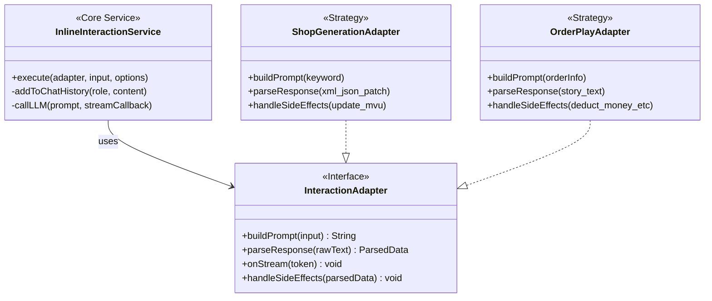

# 同层交互架构实施计划 (TODO.md)

本计划旨在建立一套模块化、可扩展的“同层交互”架构，使“店铺生成”和“下单游玩”等场景能够复用核心逻辑，实现在不刷新酒馆楼层的情况下与 LLM 进行深度交互和状态更新。

## 1. 架构设计 (Architecture)

采用 **Service-Adapter** 模式，将底层的 LLM 通信逻辑与上层的业务规则分离。

## 2. 核心模块开发 (Core Modules)

### 2.1 同层交互服务 (InlineInteractionService)

位于 `src/utils/inline-interaction/core.ts` (需新建)

- [ ] **Interface 定义**:
  - `InputData`: 泛型，业务输入数据。
  - `ParsedData`: 泛型，解析后的数据。
  - `ExecutionOptions`: `{ silent?: boolean, stream?: boolean }`。
- [ ] **`execute` 方法实现**:
    1. 调用 `adapter.buildPrompt(input)` 获取完整 Prompt。
    2. (可选) 调用 `createChatMessages` 写入 User 历史 (Silent Mode)。
    3. 调用 `generate` (支持流式)。
    4. 流式回调中调用 `adapter.onStream(token)`。
    5. 生成结束后，调用 `adapter.parseResponse(rawText)`。
    6. 调用 `adapter.handleSideEffects(parsedData)` 执行业务逻辑 (如 MVU 更新)。
    7. (可选) 调用 `createChatMessages` 写入 Assistant 历史 (Silent Mode)。
    8. 返回 `ParsedData`。

### 2.2 MVU 集成工具 (MvuHelper)

位于 `src/utils/mvu-helper.ts` (需新建)

- [ ] **MVU 初始化检查**: 封装 `waitGlobalInitialized('Mvu')`。
- [ ] **JSON Patch 执行器**:
  - 提供 `applyJsonPatch(patchArray)` 方法。
  - 内部调用 `Mvu.getMvuData`, `jsonpatch.apply_patch`, `Mvu.replaceMvuData`。

## 3. 业务适配器开发 (Business Adapters)

### 3.1 店铺生成适配器 (ShopGenerationAdapter)

位于 `src/utils/inline-interaction/adapters/shop-generation.ts`
参考：`初始模板/zod mvu店铺/后台系统触发指南.txt`

- [ ] **Prompt 模板构建**:
  - 整合 `<APP总设定>`, `formatting_rules`, `image_generation_rules`, `description` 等规则。
  - 实现将用户关键词 (Search Keyword) 注入模板的逻辑。
  - **关键**: 确保输出格式包含 `[手机界面开始]` 和 `<json_patch>` 标签。
- [ ] **响应解析**:
  - 提取 `[手机界面开始]` 到 `[手机界面结束]` 之间的内容。
  - 提取 `<json_patch>...</json_patch>` 中的 JSON 字符串。
  - 使用 `JSON.parse` 转换为对象。
- [ ] **副作用处理 (Side Effects)**:
  - 调用 `MvuHelper.applyJsonPatch` 更新 `/店铺列表` 变量。
  - 触发前端 Store (如 `useShopStore`) 的刷新动作。

### 3.2 下单游玩适配器 (OrderPlayAdapter)

位于 `src/utils/inline-interaction/adapters/order-play.ts`
(预留接口，后续完善)

- [ ] **Prompt 模板构建**:
  - 包含：当前店铺信息、套餐详情、用户备注。
  - 指令：要求 AI 进行角色扮演，生成一段剧情。
- [ ] **响应解析**:
  - 提取剧情文本。
  - (进阶) 提取可能的扣费或状态变更指令。
- [ ] **副作用处理**:
  - 将剧情文本用于 UI 展示 (如打字机效果弹窗)。

## 4. 前端集成 (Frontend Integration)

### 4.1 首页改造 (Home.vue)

- [ ] **引入 Service**: 导入 `InlineInteractionService` 和 `ShopGenerationAdapter`。
- [ ] **改造搜索**:
  - 替换原有的 `search` 函数。
  - 调用 `InlineInteractionService.execute(new ShopGenerationAdapter(), keyword)`。
  - 添加 Loading 状态指示 (流式生成期间)。
- [ ] **状态响应**:
  - 监听 MVU 变量变化，自动更新店铺列表视图。

### 4.2 商品详情页改造 (ItemDetail.vue)

- [ ] **引入 Service**: 导入 `InlineInteractionService` 和 `OrderPlayAdapter`。
- [ ] **改造下单**:
  - 替换 `confirmOrder` 函数。
  - 调用 `InlineInteractionService.execute(new OrderPlayAdapter(), { item, remark })`。
  - 显示生成结果 (剧情)。

## 5. 开发顺序 (Execution Plan)

1. **基础建设**: 创建 `src/utils/inline-interaction/` 目录，实现 `core.ts` 和 `MvuHelper`。
2. **适配器实现**: 优先实现 `ShopGenerationAdapter`，硬编码 Prompt 模板。
3. **UI 集成 (Home)**: 在 `Home.vue` 中接入新的生成逻辑，验证“店铺生成”流程。
4. **UI 集成 (ItemDetail)**: 在 `ItemDetail.vue` 中接入，验证“下单”流程。
5. **测试与优化**: 验证 MVU 变量是否正确更新，历史记录是否正确写入，流式效果是否流畅。
